Berialdraw Library is a fully vector-based C++ graphics library, designed to be simple to use, lightweight to run on small processors.

Features:
- Supports anti-aliasing and transparency
- Manages several simple widgets and color themes
- Offers the ability to export screens to SVG
- Draws Bezier curves with rotation and resizing
- Defines some simple widgets like Edit, Label, Button, Layout, ScrollView, Slider...
- Includes a tool to trace memory leaks and find them
- Includes a tool to automate user interface unit tests
- Provides the ability to reskin widgets by json file

**Berialdraw is incomplete and still under development, but it works on Windows, OSX and probably any OS that supports SDL.**

Git clone :
git clone --recurse-submodules https://github.com/remibert/berialdraw.git

[C++ Api documentation](berialdraw/doc/html/index.html)

Click on the image to see the source code that produces this screen, example code for each widget :

[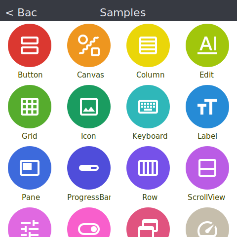](berialdraw/samples/icon_menu_dialog.cpp)

[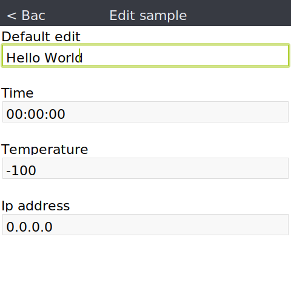](berialdraw/samples/sample_edit.cpp)
[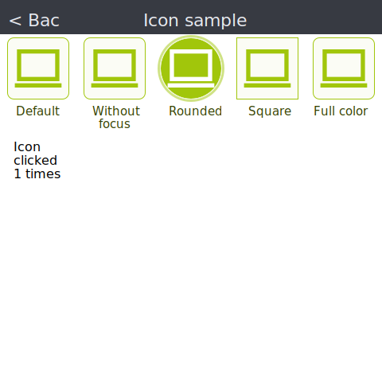](berialdraw/samples/sample_icon.cpp)
[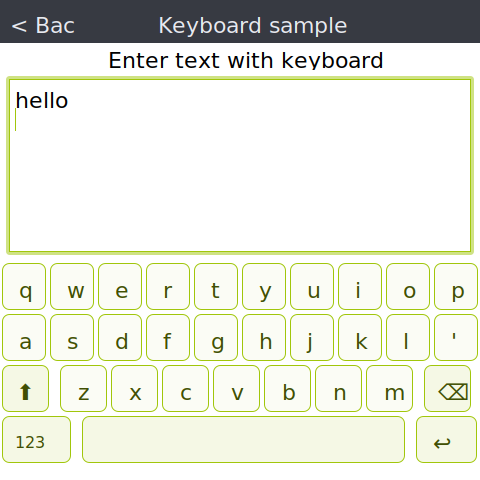](berialdraw/samples/sample_keyboard.cpp)
[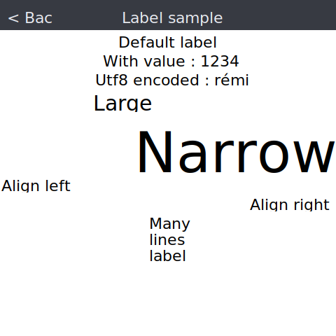](berialdraw/samples/sample_label.cpp)
[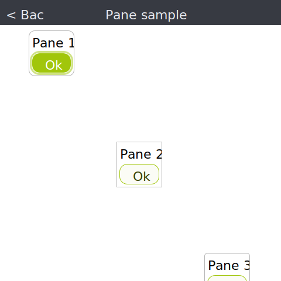](berialdraw/samples/sample_pane.cpp)
[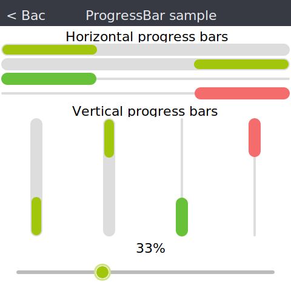](berialdraw/samples/sample_progress_bar.cpp)

[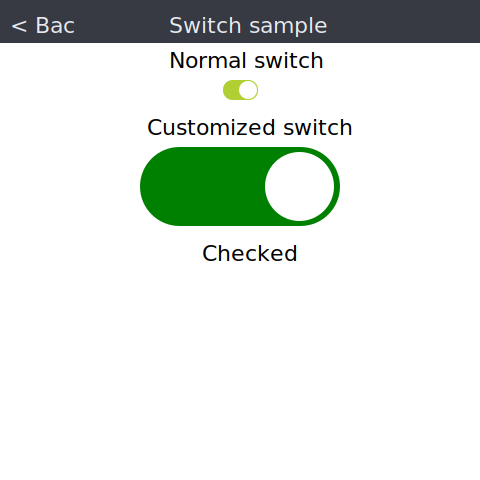](berialdraw/samples/sample_switch.cpp)

Example drawing

[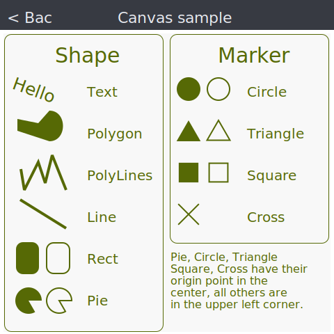](berialdraw/samples/sample_canvas.cpp)

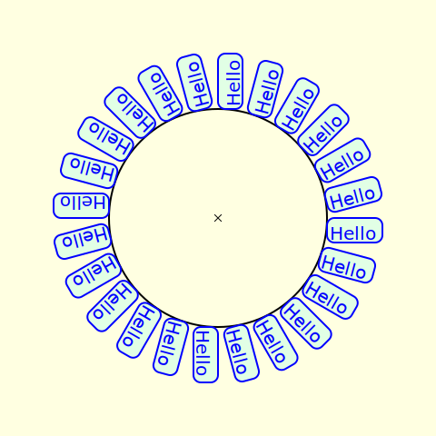

Color theme available

[
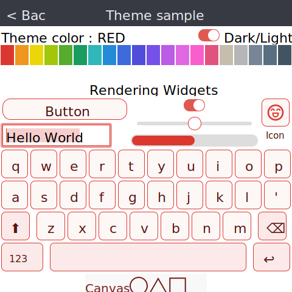

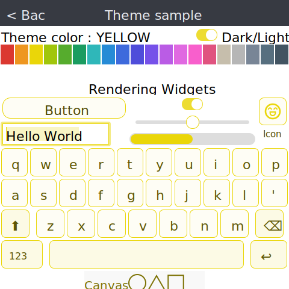

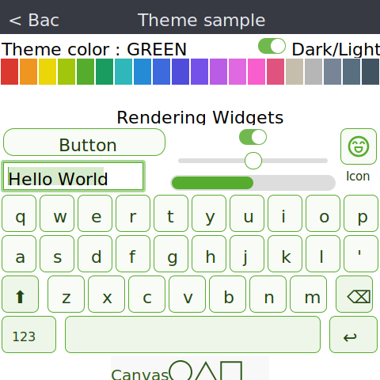

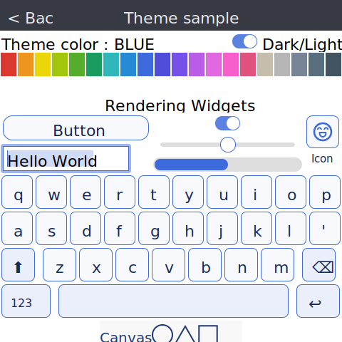
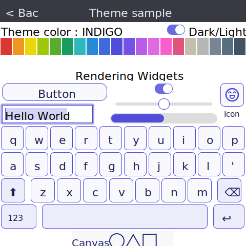
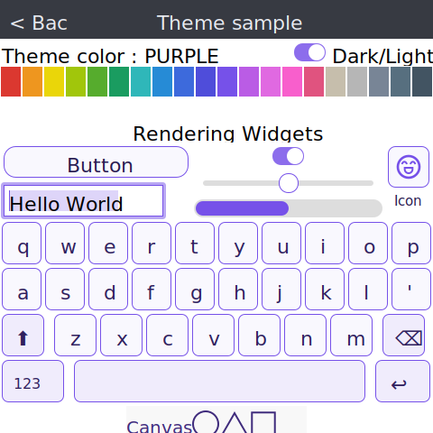
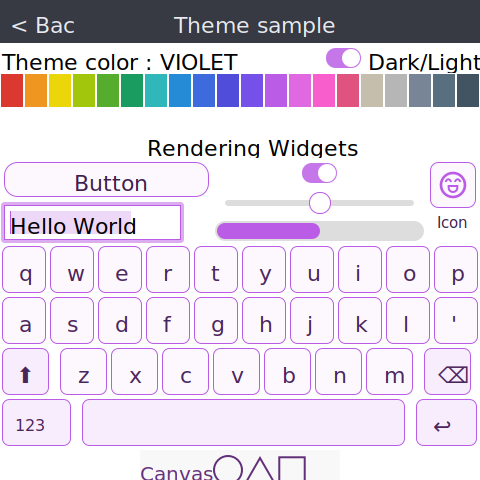
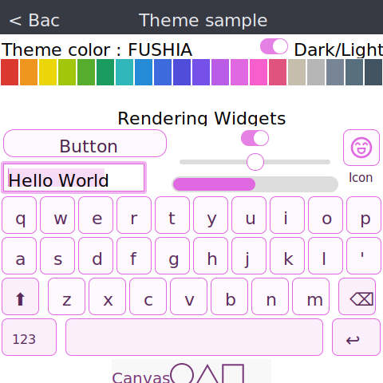
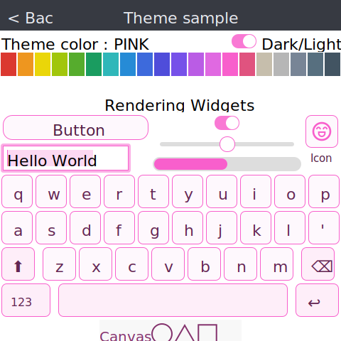
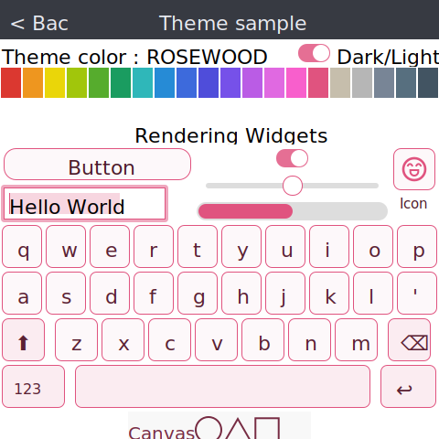

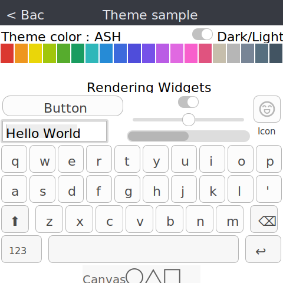

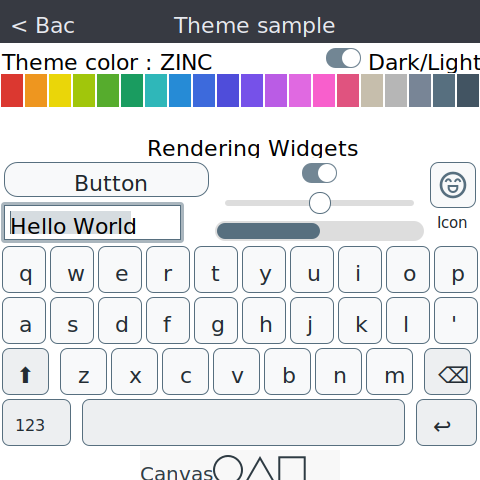
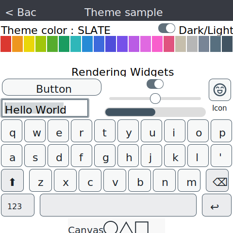

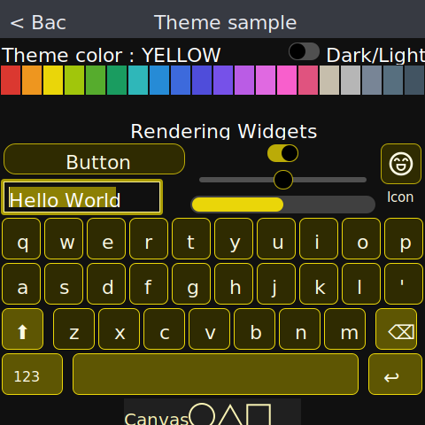
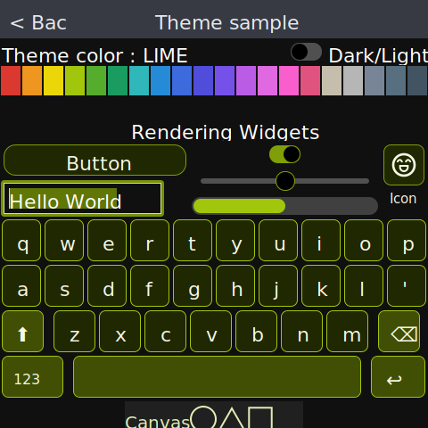
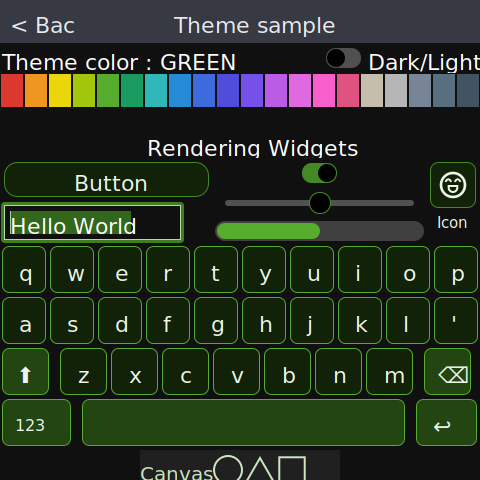
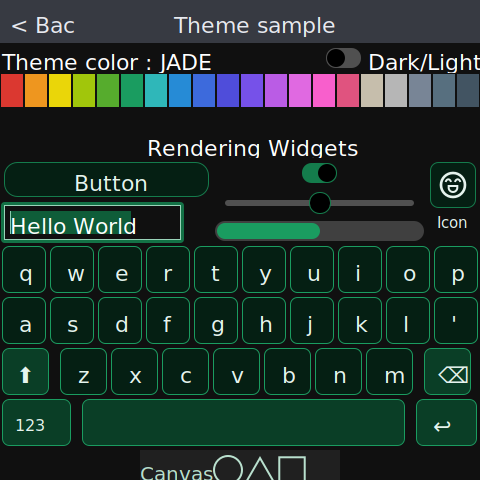

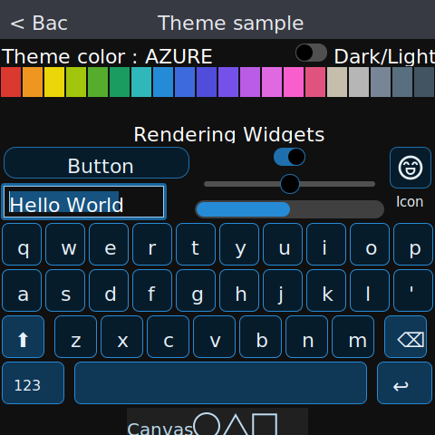
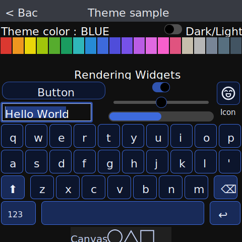
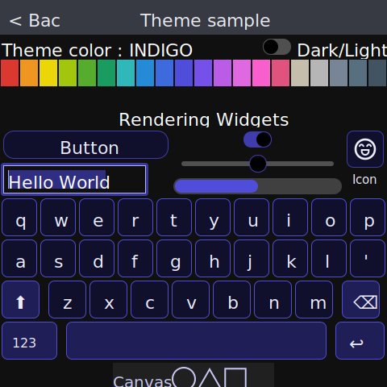
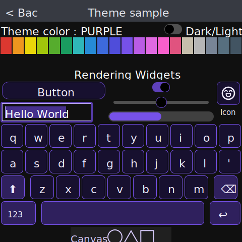

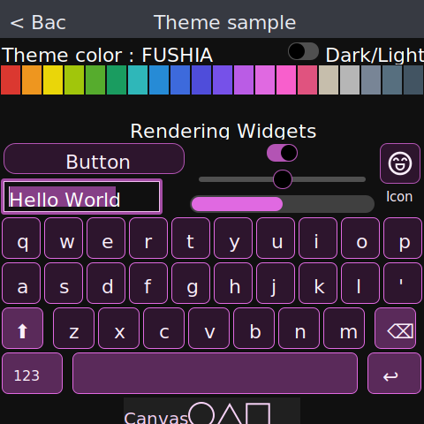
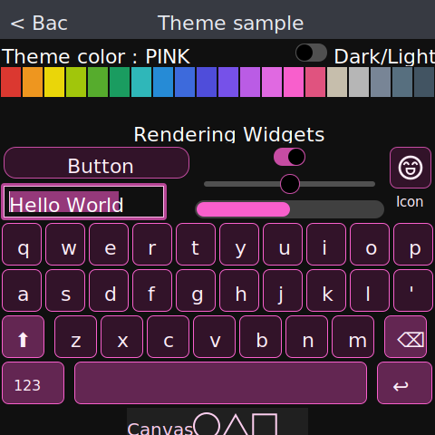
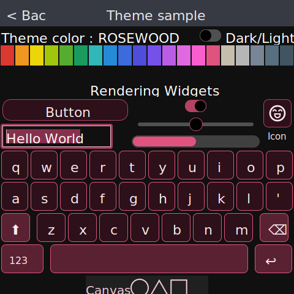
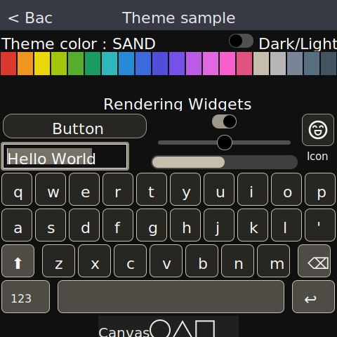
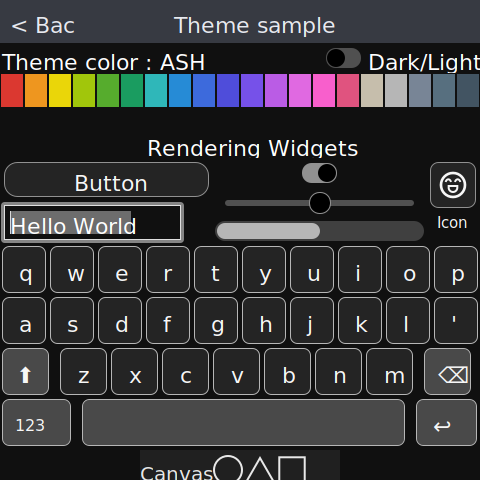
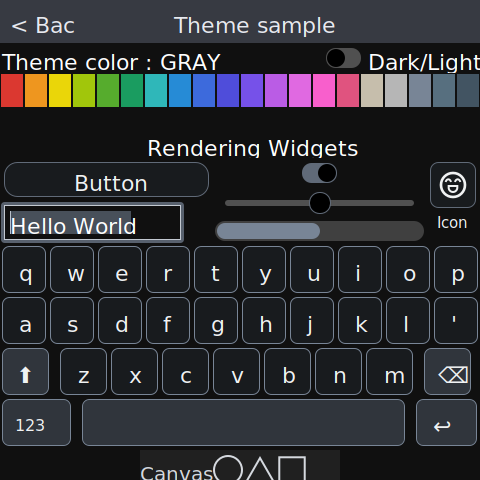
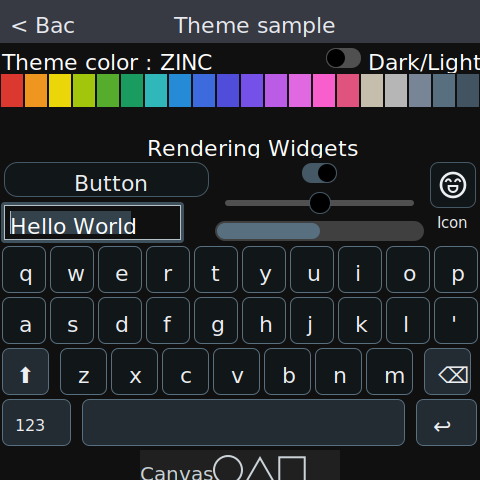
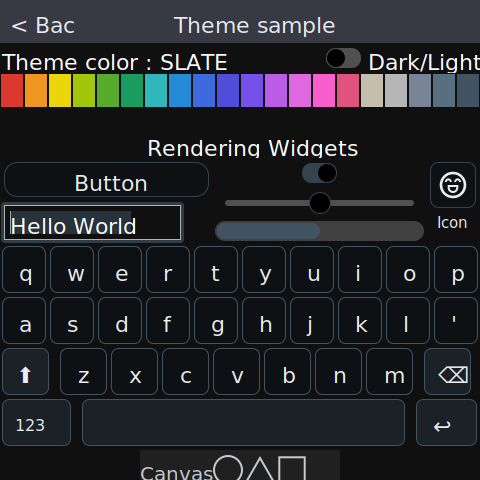](berialdraw/samples/sample_theme.cpp)

Example code for managing placement layouts :

[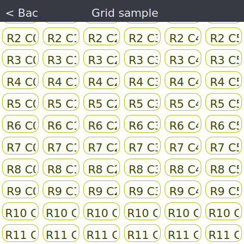](berialdraw/samples/sample_grid.cpp)
[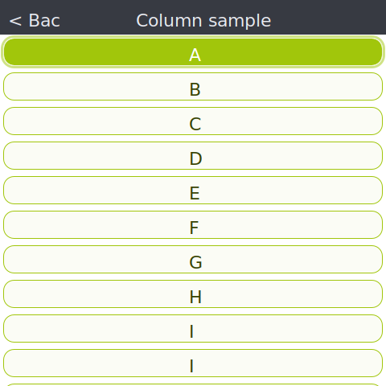](berialdraw/samples/sample_column.cpp)

