To create a TTF file, you need FontForge and to open the SVG file:

## Steps

1. **Right-click** on the black square and **delete** it.
2. **Select all characters** in the font.

3. Go to the menu: `Element > Simplify > Simplify`.
   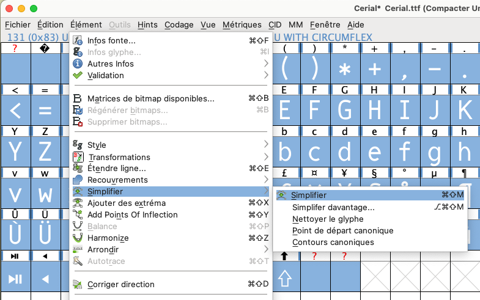

4. Go to the menu: `Element > Round > Round to int`.
   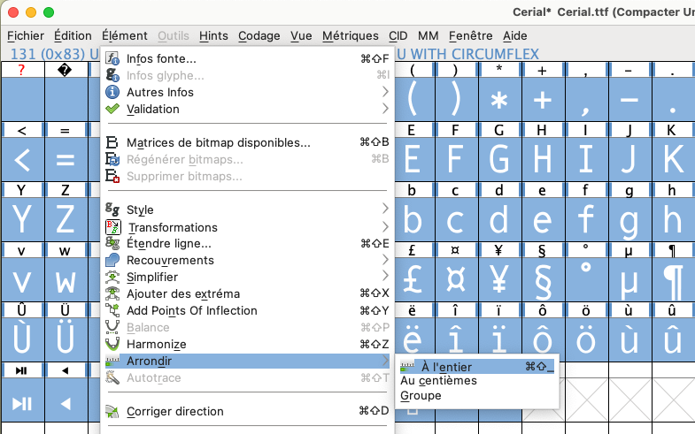

5. Go to the menu: `Element > Correct direction`.
   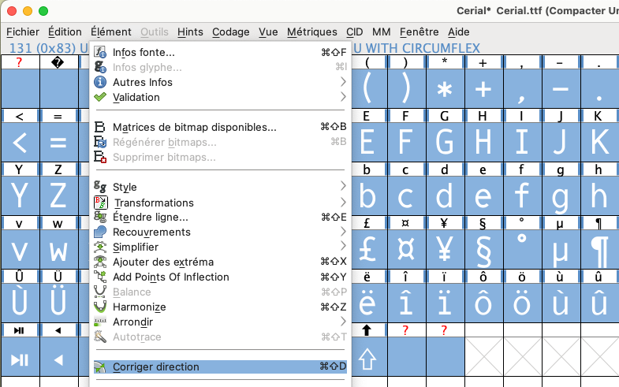

6. Go to the menu `Codage/Compact`
   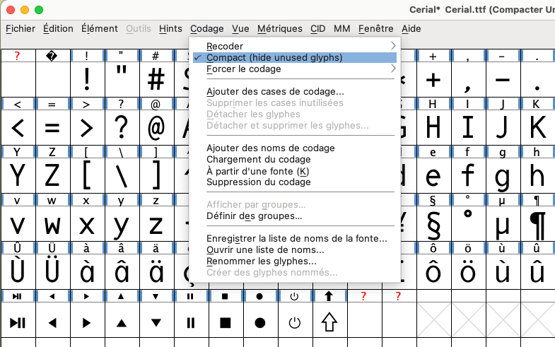

7. Go to the menu: `Element > Transformations`
	 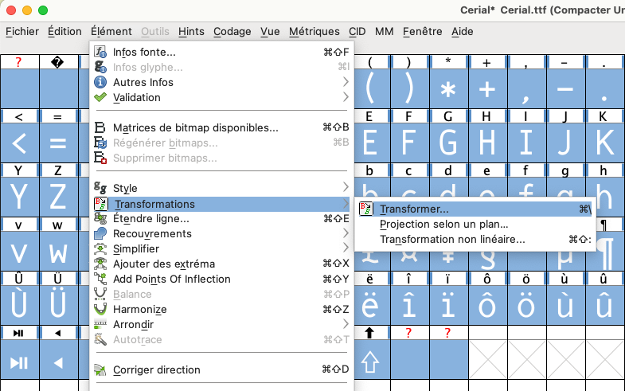
   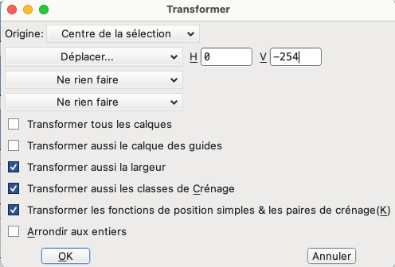

8. Go to the menu: `Element > Font Info`:
   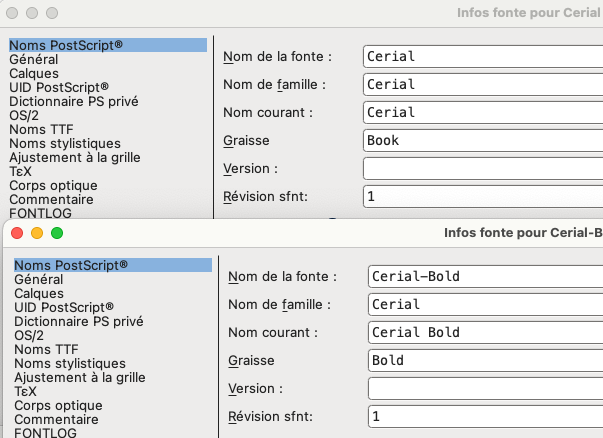

   - OS/2 General
   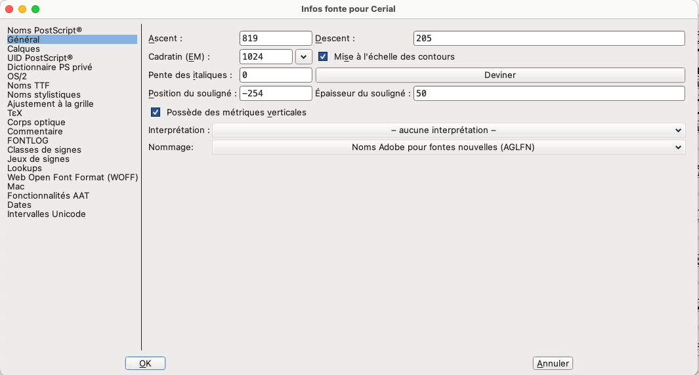

   - OS/2 Metric
   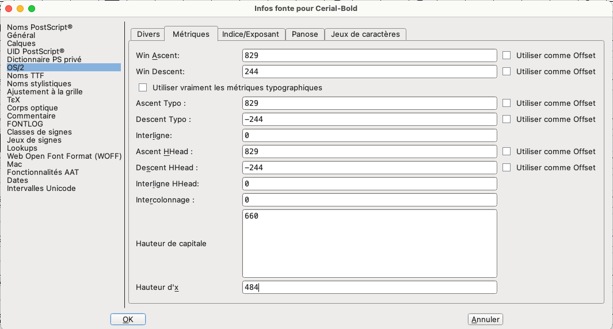

 - **Regular font**

   - OS/2 Regular
   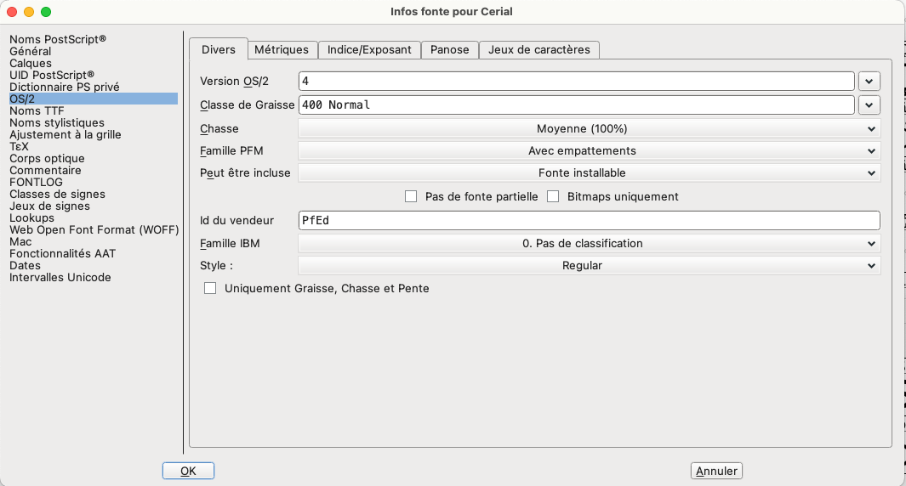

   - OS/2 Panose
   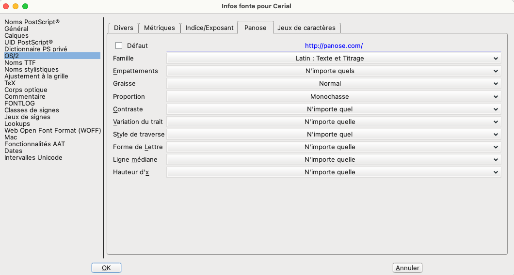

   - For MAC regular
   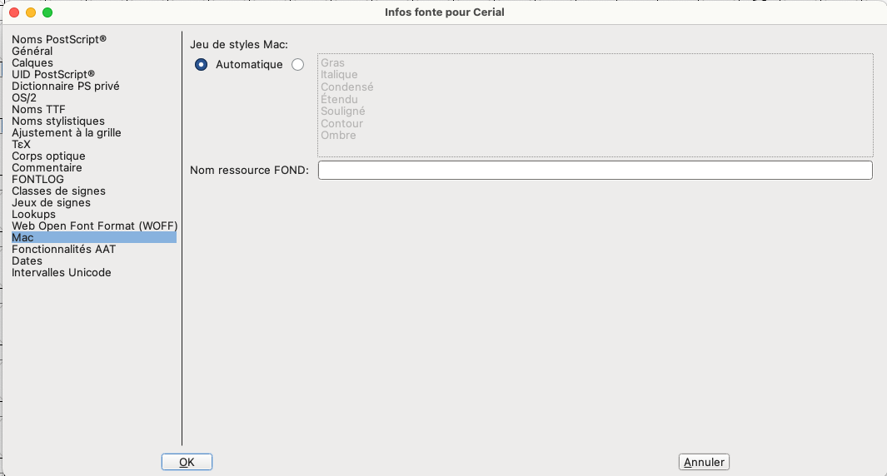

 - **Bold font**

   - OS/2 Bold
   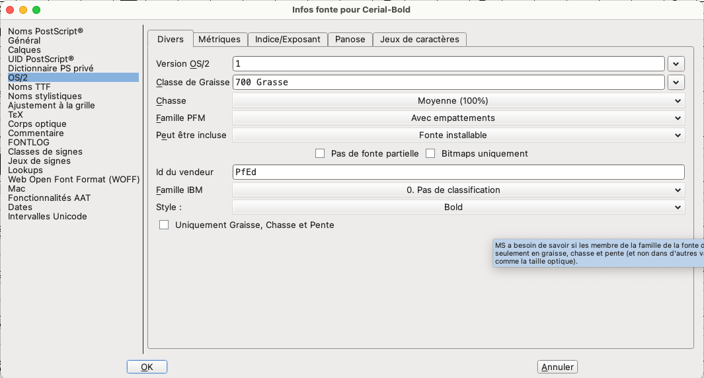

   - OS/2 Panose
   

   - For MAC bold
   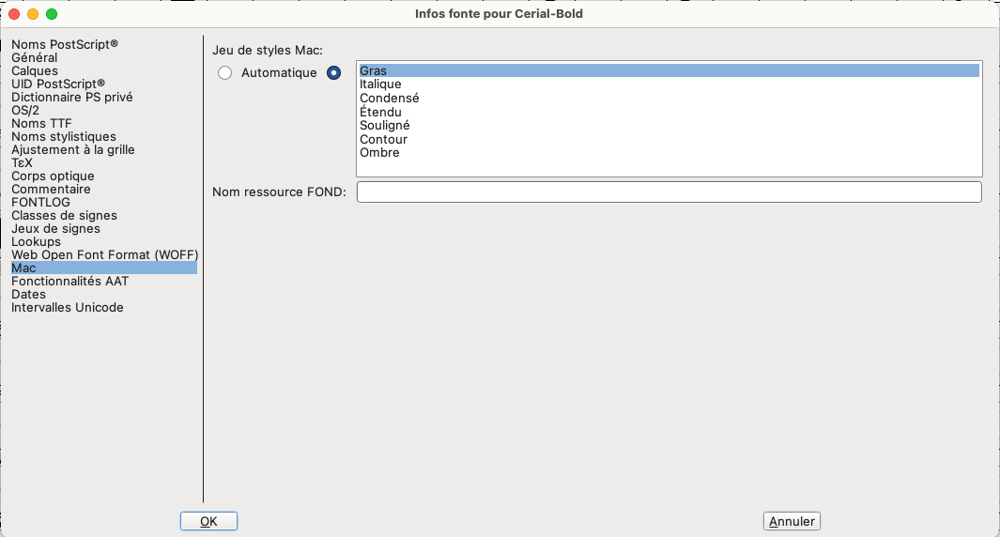

1. Go to `File > Generate Fonts`:
   - Choose the directory and name the file `Cerial.ttf`
   - Click **Yes** when prompted
   - Click **Generate**
